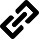

`puri` ("parse uri") is a robust commandline utility that reads and extracts uri components. It processes URLs
with and without schemes.

[](https://circleci.com/gh/simonmittag/puri)
[](https://github.com/simonmittag/puri/actions)
[](https://github.com/simonmittag/puri/issues)
[](https://img.shields.io/github/commit-activity/m/simonmittag/puri)  
[](https://codeclimate.com/github/simonmittag/puri/maintainability)
[](https://codeclimate.com/github/simonmittag/puri/test_coverage)
[](https://img.shields.io/github/go-mod/go-version/simonmittag/puri)
[](https://opensource.org/licenses/Apache-2.0)
[](https://github.com/simonmittag/puri/releases/tag/v0.1.8)

## What's New
### v0.1.8
* bugfix for url paths containing domains

### v0.1.7
* added simple path parsing that makes this more intuitive over standard library interpretation

## Up and running
### Homebrew
```
brew tap simonmittag/cli &&
  brew install puri &&
  puri 
```

### Golang
```bash
git clone https://github.com/simonmittag/puri && cd puri && 
go install github.com/simonmittag/puri/cmd/puri && 
puri 
```

## Usage
```
λpuri[v0.1.8]
Usage: puri [-s]|[-o]|[-r]|[-p]|[-q name]|[-h]|[-v] scheme://host:port#a?k=v
  -h	print usage instructions
  -o	extract host
  -p	extract path
  -q string
    	extract query param
  -r	extract port
  -s	extract scheme
  -v	print puri version
```

## Examples

Get URI path without scheme specified
```
λ puri -p bar.com/foo?k=foo
  /foo
```

Get URI host without scheme specified
```
λ puri -o bar.com?k=foo
  bar.com
```

Get URI query param
```
λ puri -q k https://www.bar.com?k=foo
  foo
```

Get URI path (includes anchor)
```
λ puri -p https://www.foo.com/q#bar?k=v
  /q#bar
```


## Contributions
The puri team welcomes all [contributors](https://github.com/simonmittag/puri/blob/master/CONTRIBUTING.md). Everyone interacting with the project's codebase, issue trackers, chat rooms and mailing lists
is expected to follow the [code of conduct](https://github.com/simonmittag/puri/blob/master/CODE_OF_CONDUCT.md)